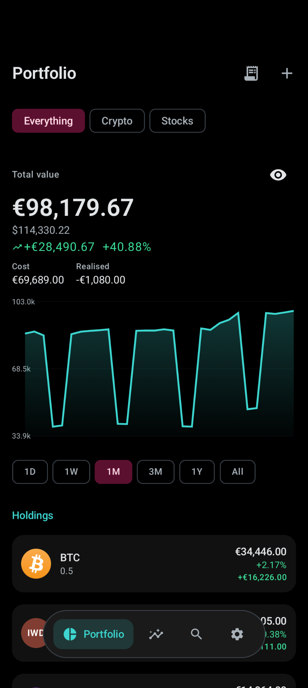
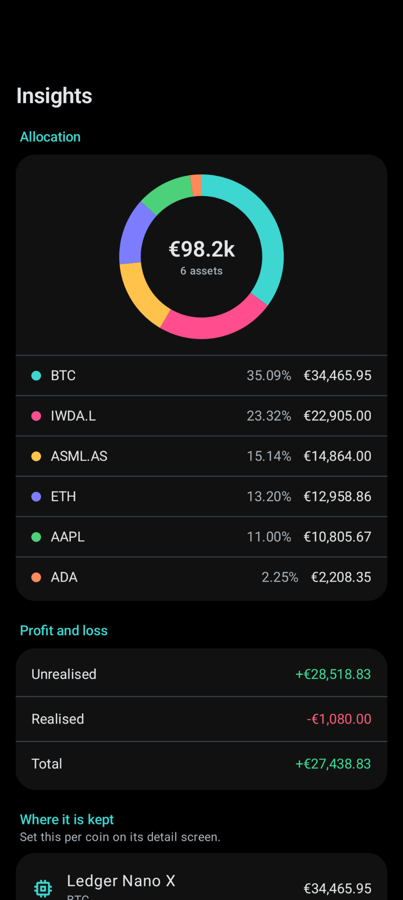
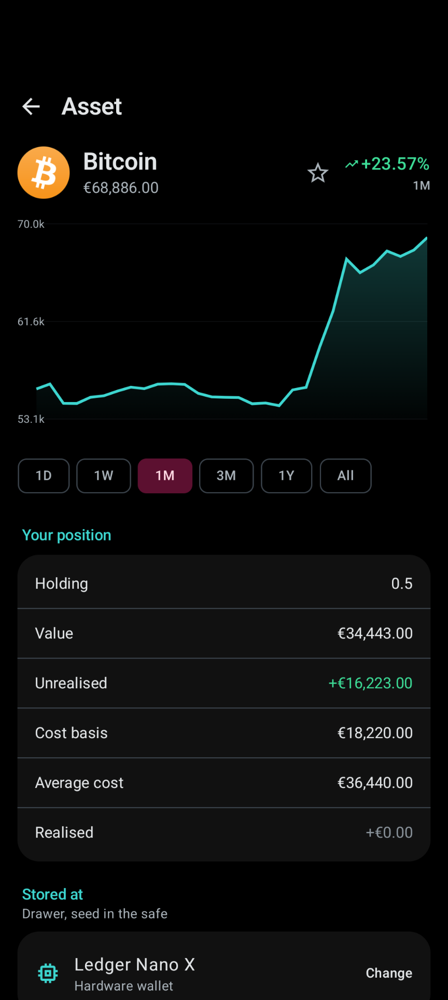
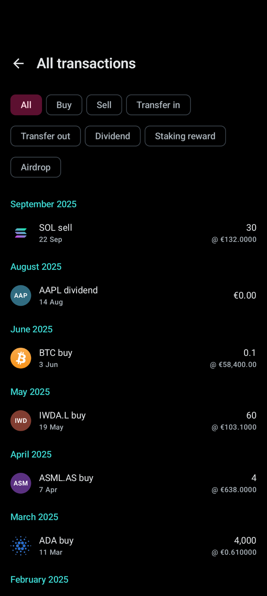
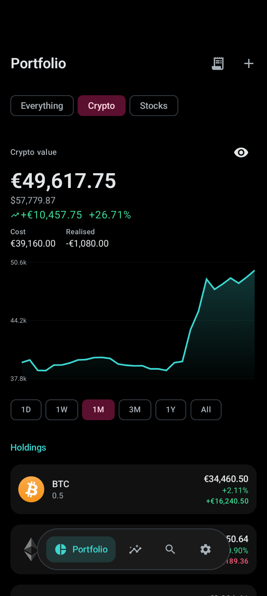
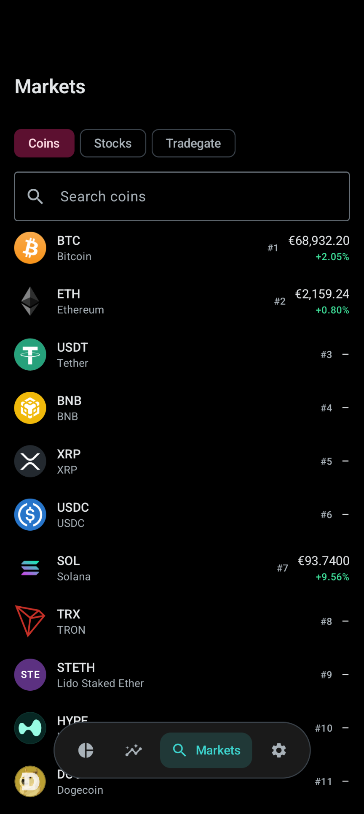
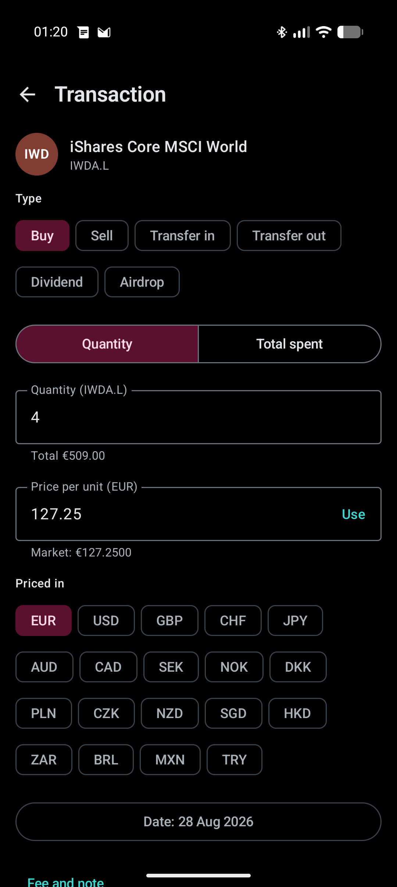
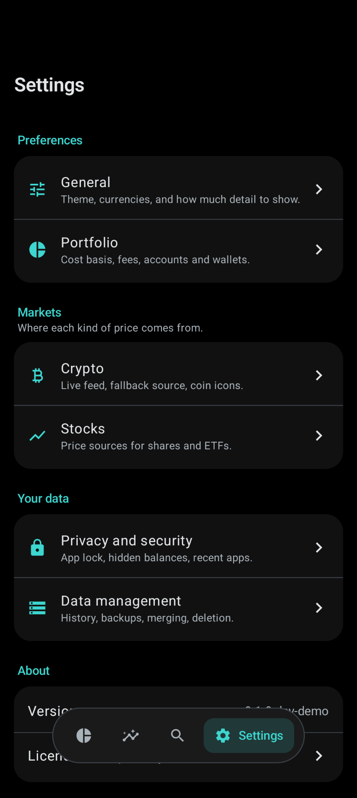

# Eddies

A portfolio tracker for Android that keeps your holdings on your phone. Crypto
and stocks, together or separately.

No account, no server of its own, no analytics. The database is encrypted, the
app asks for one permission (internet), and the only thing it sends anywhere is
which instruments to price.

Named after Cyberpunk 2077's eurodollars, which turned out to fit: EUR and USD
are the two currencies it ships with.

## Screenshots

<table>
  <tr>
    <td width="25%"></td>
    <td width="25%"></td>
    <td width="25%"></td>
    <td width="25%"></td>
  </tr>
  <tr>
    <td align="center"><b>Everything in one place</b><br><sub>Or filtered to crypto, or to stocks</sub></td>
    <td align="center"><b>Where the money sits</b><br><sub>Allocation, realised and unrealised</sub></td>
    <td align="center"><b>Per asset</b><br><sub>Cost basis, average cost, custody</sub></td>
    <td align="center"><b>Every transaction</b><br><sub>Buys, sells, dividends, rewards</sub></td>
  </tr>
  <tr>
    <td width="25%"></td>
    <td width="25%"></td>
    <td width="25%"></td>
    <td width="25%"></td>
  </tr>
  <tr>
    <td align="center"><b>One class at a time</b><br><sub>Crypto and stocks each stand alone</sub></td>
    <td align="center"><b>Markets</b><br><sub>Coins, shares, or an ISIN on Tradegate</sub></td>
    <td align="center"><b>Adding a position</b><br><sub>Any currency, converted for you</sub></td>
    <td align="center"><b>Settings</b><br><sub>Grouped by subject, not by widget</sub></td>
  </tr>
</table>

[See all screenshots](docs/screenshots/)

<sub>From the demo build (`make demo`), which ships a fabricated portfolio. The
numbers are invented. The prices, charts and staking figures in it are live.</sub>

## What it does

- **Live crypto prices** over a public WebSocket from Kraken or Binance, your
  choice, with a REST source covering coins no exchange lists.
- **Stocks, ETFs and funds**, including Tradegate, which most trackers skip.
  Splits are applied correctly and dividends are tracked as income.
- **One portfolio, or two.** Filter to crypto, to stocks, or see them combined,
  each with its own chart and profit figures.
- **Real cost basis.** Positions come from a transaction ledger rather than a
  stored balance, so realised and unrealised profit are both correct after a
  partial sell. Average, FIFO, LIFO or HIFO.
- **Staking.** Point it at a Cardano stake address and rewards still accruing on
  chain are added to your holding, shown separately from what you bought.
- **Where things are kept.** Record that your BTC is on a hardware wallet and
  your ETF is at a broker, then see everything grouped by location.
- **Charts** with a draggable crosshair, allocation and movers, drawn directly
  so they follow your theme.
- **Simple by default.** Advanced mode adds cost basis, realised P/L and
  per-row detail once you want them.
- **Encrypted backups**, plus a plain CSV export for a spreadsheet or a tax
  tool, clearly labelled as unencrypted.
- **Dark by default**, with a true-black OLED mode.

## Installing

Grab an APK from the [releases page](../../releases).

| File | For |
|---|---|
| `eddies-<version>-arm64-v8a.apk` | Almost every phone made since 2017. Start here. |
| `eddies-<version>-armeabi-v7a.apk` | Older 32-bit devices. |
| `eddies-<version>-x86_64.apk` | Emulators. |
| `eddies-<version>-universal.apk` | Works everywhere, roughly twice the size. |

## Privacy

Eddies talks to a handful of services, and only about prices:

- an exchange (Kraken or Binance) for live crypto prices
- CoinPaprika, or CoinGecko with your own key, for coins no exchange lists
- Yahoo Finance, or Finnhub with your own key, for shares
- Tradegate, for instruments held there
- Koios, if you add a Cardano stake address
- Frankfurter, for European Central Bank currency rates

Those requests name the instruments being priced, which is unavoidable for a
price. It is why coin icons ship inside the app rather than being fetched, and
why coin search works offline unless you turn remote lookup on.

Your ledger lives in a SQLCipher-encrypted database whose key is held in the
Android Keystore. System backups are switched off, because a restored copy would
carry a database the new phone has no key for. Portable backups are the
passphrase-encrypted file you write yourself, deliberately independent of the
Keystore so it opens anywhere.

## Building

Everything runs in a container, so no local JDK or Android SDK is needed.

```
make test      # unit tests, the fast gate
make build     # debug APK -> build-output/
make demo      # demo APK with a fabricated portfolio, for screenshots
make lint
make release   # release APKs, signed if a keystore is configured
```

`make demo` produces a separate app that installs alongside the real one. It has
its own applicationId and therefore its own database, so it cannot see your
holdings.

Tag `v*` and push to cut a release. GitHub Actions runs the tests, builds the
APKs and attaches them.

Contributors and agents: [AGENTS.md](AGENTS.md) has the architecture, the
invariants and the things that look wrong until you know why.

## Licence

Free software under the [GPLv3](LICENSE).

In short: use it, study it, change it, share it. If you distribute a modified
version you have to publish your changes under the same licence. That is the
point. The reason to run Eddies is that it holds your holdings and sends nothing
anywhere, and a licence that let someone ship a closed fork with analytics
bolted on would quietly undo the only thing it is for.

Bundled coin icons come from
[ErikThiart/cryptocurrency-icons](https://github.com/ErikThiart/cryptocurrency-icons)
(MIT) and [spothq/cryptocurrency-icons](https://github.com/spothq/cryptocurrency-icons)
(CC0).
