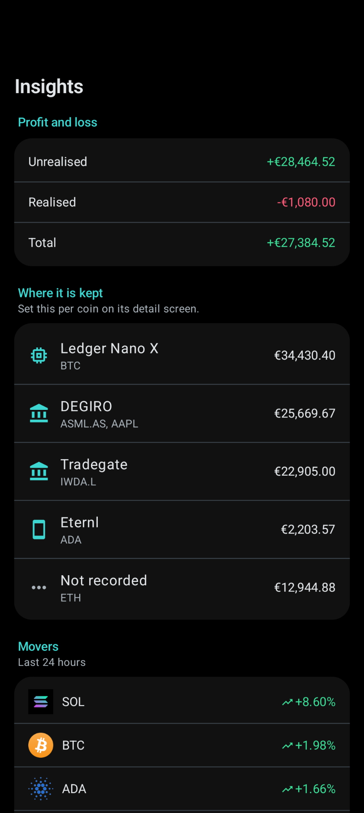

# Screenshots

All taken from the demo build (`make demo`), which installs alongside the real
app with a fabricated portfolio. The holdings and transactions are invented. The
prices, charts and staking figures are live, fetched through the same code the
real app uses.

| | |
|---|---|
|  |  |
| **Portfolio, everything** | **Portfolio, crypto only** |
|  |  |
| **The full ledger** | **Insights: allocation and profit** |
|  |  |
| **Insights: where it is kept** | **Markets, with search** |
|  |  |
| **Asset detail** | **Adding a transaction** |
|  | |
| **Settings** | |

## Replacing these

Build the demo app, take the shots, drop them in here with the same numbering.

```
make demo
```

The demo build deliberately does not set FLAG_SECURE, so screenshots work even
with "hide from recent apps" turned on. The real build does set it, which is why
these cannot be taken from an ordinary install.
